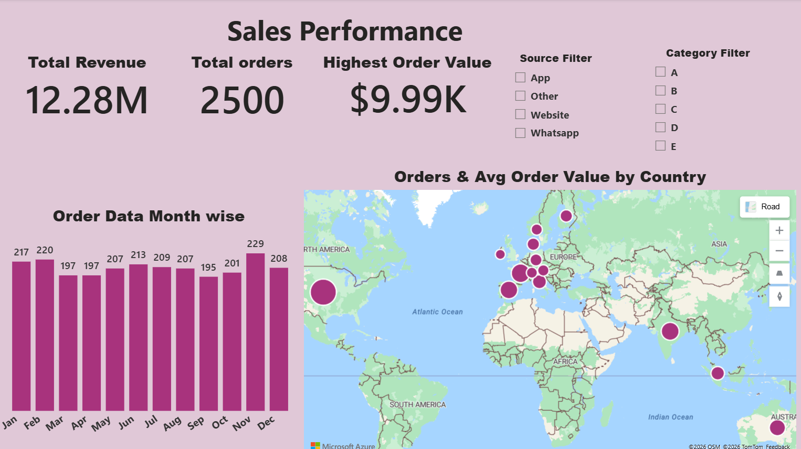
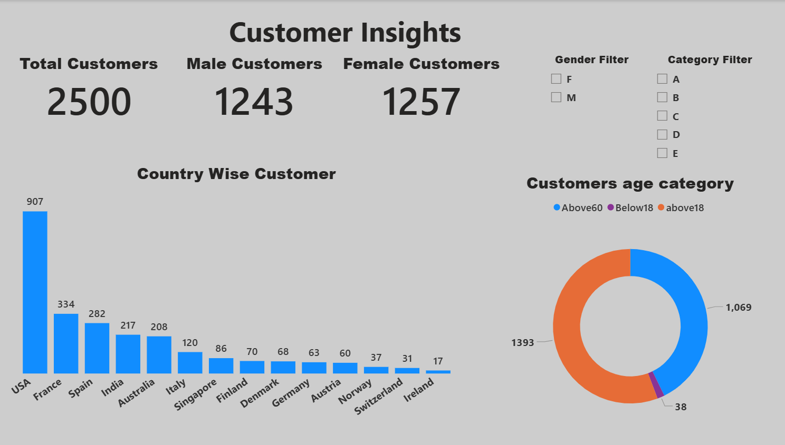
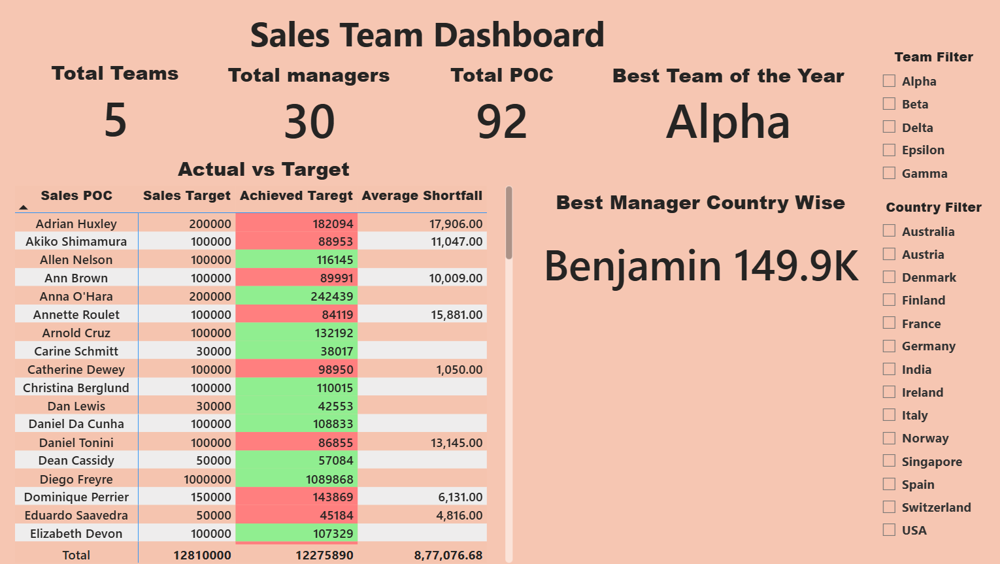

# 📊 Sales Performance Dashboard (Power BI)

## 🔍 Quick Summary
Interactive Power BI dashboard designed to analyze sales performance, customer insights, and team productivity.  
Provides clear business insights through KPIs, trends, and performance tracking.

---

## 🛠 Tools Used
- Power BI  
- Excel  
- DAX  
- Data Modeling  
- Data Visualization  

---

## 📈 Key Insights
- Customer distribution across countries  
- Sales performance trends over time  
- Sales team target vs achievement  
- Manager and team performance analysis  

---

## 🧩 Dataset Description

The project is built using three main datasets:

### Orders
Contains transaction-level data:
- Order ID  
- Order Datetime  
- Order Value  
- Order Source  
- Sales POC  

### Customers
Contains customer demographics:
- Customer ID  
- Age  
- Gender  
- Country  
- Customer Category  

### Sales Targets
Contains sales targets:
- Sales POC  
- Sales Manager  
- Sales Team  
- 2023 Sales Target  

---

## 🔗 Data Model

Relationships used:

- Customers[Customer ID] → Orders[Customer ID]  
- Sales Targets[Sales POC] → Orders[Sales POC]  

This model enables analysis by:
- Customer demographics  
- Country  
- Sales team and manager  

---

## 📊 Dashboard Views

### Customer Insights

- Customer distribution by country  
- Gender segmentation  
- Age group analysis  

---

### Sales Performance

- Total Revenue KPI  
- Total Orders KPI  
- Monthly trends  
- Country-level performance  

---

### Sales Team Performance

- Target vs achieved sales  
- Best performing team  
- Manager-level insights  

---

## 📐 Sample DAX Measures

- Total Revenue = SUM(Orders[Order Value])  
- Total Orders = COUNT(Orders[Order ID])  
- Average Order Value = DIVIDE([Total Revenue], [Total Orders])  

---

## 💼 Business Impact

- Helps track revenue trends and sales performance  
- Identifies high-performing teams and managers  
- Enables data-driven decision making  
- Improves visibility into customer and sales behavior  

---

## 📄 Full Report

Download complete dashboard: **Sales_Dashboard.pdf**

---

🔗 Author: https://github.com/LTSGFH
